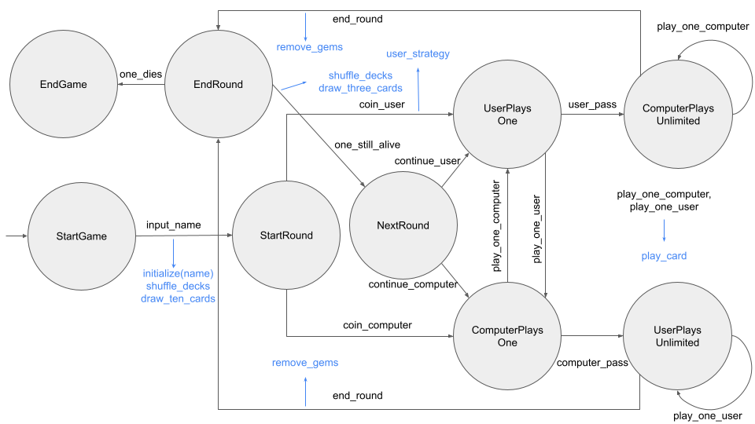

# Gwen't

This work is licensed under a
[Creative Commons Attribution 4.0 International License](http://creativecommons.org/licenses/by/4.0/)

Context
-------

This project's goal is to create a (simplified) clone of the
[_Gwent_](https://www.playgwent.com/en)card game developed by [_CD PROJEKT RED_](https://cdprojektred.com/en/)

---

A continuación se encuentran explicaciones del diseño general del juego, dividido para las entregas 3, 2 y 1. 

---

# Tarea 3

El flujo del juego **se modela con el patrón de diseño State**, que permite definir ciertos estados y solo algunas transiciones permitidas entre ellos. A continuación se muestra el diagrama de estados que lo representa:

Las habilidades se implementan como clases concretas que se agrupan en dos tipos según la interfaz, UnitAbility o WeatherAbility. Dentro de la definición de cada clase concreta se define el efecto que realiza la carta con efecto (new) a la carta que recibe el efecto (target), de modo que el código es extensible para nuevas habilidades, solo basta agregar una nueva clase concreta.

Cada carta contiene un atributo que especifica su efecto, incluso aquellas cartas de unidad que no tienen habilidad. Para esto, **se utiliza el patrón de diseño Null Object**, que permite definir una clase concreta NullAbility, que es una clase de habilidad que no hace nada al aplicar su efecto. De esta manera, no es necesario dividir las cartas de unidad en aquellas que tienen o no habilidad y preguntarse si una carta dada tiene o no habilidad para aplicar su efecto.

Para que una carta de unidad pueda ejercer su efecto, **se utiliza el patrón de diseño Observer**. Cada zona acumula cartas que se guardan en una colección de observadores. Cada carta que ya está jugada en el tablero observa su zona para estar atenta a cuando llega una nueva carta que aplique un efecto sobre ella. En el caso de las cartas de clima, al jugarse estas inmediatamente se informa su llegada a todo el tablero, que informa a sus dos lados, que informan a sus tres zonas, que informan a cada una de sus cartas, en caso de que el efecto de la carta de clima jugada afecte dicha zona. Para resolver cuándo ocurre esto último, se añade un atributo a las zonas que indica todas los efectos de clima a los que son susceptibles las cartas de esta zona. Esto permite fácilmente modificar el rango que abarca un efecto de clima.

Para notificar al controlador que se acabaron las gemas a un jugador, **se utiliza el patrón de diseño Observer**. El observador es el controlador y los sujetos observados son los dos jugadores, de modo que si un jugador pierde una gema, quedando con cero gemas, este notifica al controlador, que cambia de estado. También se ha considerado el caso de borde donde ambos jugadores pierden una gema a la vez. Esta implementación de notificar al controlador es extensible, debido a que, si se busca notificar al controlador desde alguna otra clase, basta que esta extienda de la clase abstracta Subject, se suscriba al controlador y se utilice el método de notificar donde corresponda.

---

# Tarea 2

Para implementar el tablero, se ha pensado en cómo se vería este físicamente. De esta manera, resulta natural que el tablero, de tipo Board, se componga de dos lados de tipo Side y una zona común donde se juegan cartas de clima, de tipo WeatherZone. A su vez, cada lado se compone de tres zonas de tipos CloseRow, RangedRow y SiegeRow para jugar las cartas de unidad. Los lugares donde se juegan cartas resultan tener comportamientos similares, por lo que se crea una interfaz Zone que representa una zona donde puede ser jugada una carta. Asimismo, hay comportamientos cuyas implementaciones son comunes para las tres zonas, por lo que se crea una clase abstracta AbstractZone. La estructura básica de una zona es simplemente un conjunto de cartas, un CardSet, al que se le pueden agregar y quitar cartas.

Para implementar la funcionalidad de jugar una carta, se ha pensado en cómo se implementará a futuro el controlador. Si se espera un input de un usuario para jugar una carta, es lógico que sea el jugador quien juega una carta sobre su lado del tablero. Por lo tanto, se ha optado por que los jugadores tengan un lado de tablero, de tipo Side. Así, al llamar al método con el que el jugador juega una carta determinada, se puede enviar un mensaje a la carta para que se juegue en el lado de tablero dado. Como la carta es de cierto tipo según su clase, puede enviarle un mensaje al lado del tablero para que la juegue en la zona que le corresponde según su tipo. De esta forma, se resuelve su ubicación sin pattern matching, con los métodos receiveClose, receiveSiege y receiveRanged. En el caso de cartas de clima, el funcionamiento es similar, solo que se debe acceder al tablero al que pertenece cada lado. Para testear la funcionalidad pedida, se ha revisado que las ocurrencias de una carta en una determinada zona aumenten si se juega en este zona.

Se han utilizado algunas excepciones para evitar comportamientos indeseados. La implementación completa de estas excepciones depende de cómo se implemente a futuro la lógica del juego en el controlador. Por ahora, se crearon excepciones para: evitar que se quiten gemas cuando ya no quedan, evitar que se jueguen cartas si no se poseen o si simplemente no hay cartas que sacar. Todas estas excepciones han sido testeadas.

Todos los atributos que requerían ser accedidos desde fuera de las clases donde estaban definidos tuvieron asociados la creación de un getter. Asimismo, se crearon setters para atributos que puedan ser asignados, ya sea porque cambian durante el juego (contadores de gemas) o para su correcta inicialización (asociarle a un jugador un lado del tablero, que ha sido definido fuera su contexto).

Se han corregido otros aspectos del diseño. Con respecto a las cartas, se ha refactorizado el código, generando una clase abstracta desde la cual extienden clases para los tres tipos de cartas de unidad, CloseUnitCard, RangedUnitCard y SiegeUnitCard. Por lo tanto, se ha trasladado la sobreescritura del método equals a estas clases concretas. Además, se ha cambiado la habilidad (aún como String, a ser modificado) de las cartas de unidad por una habilidad genérica. En lugar de un Option, se utilizará el patrón de diseño de objeto nulo para resolver los casos donde una carta con habilidad nula ejerce un efecto (no hará nada). De esta manera, toda carta tiene una habilidad.

---

# Tarea 1

En términos generales, la funcionalidad hasta ahora se reparte en dos paquetes: player y card.

Para representar a los jugadores, se crean dos clases, ComputerPlayer y UserPlayer, que representan a un jugador de computadora y a un jugador humano, respectivamente. Las clases son distintas pues las estrategias de juego son distintas: una es automática y la otra requiere de inputs del usuario. Sin embargo, las dos clases comparten funcionalidades, como sus estados (tienen gemas, mazo y mano) y métodos (perder una gema), por lo que se crea la clase abstracta AbstractPlayer de la que se hereda para no repetir el código de estas funcionalidades. Finalmente, se crea una interfaz que representa un jugador, y es implementada por la clase abstracta. Esta sirve para abstraer el comportamiento de un jugador y para referirse al tipo Player. El método equals se implementa solamente como igualdad de nombres, pues si, por ejemplo, un jugador pierde una gema, no deja de ser el mismo jugador.

Para representar a las cartas, se crean dos clases, UnitCard y WeatherCard, que representan a una carta de unidad y de clima, respectivamente. Las clases son distintas pues tienen aspectos que difieren: una carta de clima siempre tiene una habilidad, pero una carta de unidad solamente a veces la tiene. Es importante recalcar que se crea la variable habilidad como tipo String solo por ahora (es un mal diseño, no se le puede asignar responsabilidad a un string y dificulta la creación y definición de los efectos), pues aún no se implementan las habilidades. Nuevamente, a pesar de ser distintas, comparten funcionalidades que tienen que ver con cómo se posicionan en el tablero, que se especifican en AbstractCard. Por ahora, esto no se implementa pues requiere del tablero. Finalmente, se crea una interfaz para las cartas que encapsulan comportamientos generales. El método equals se implementa como es habitual, mediante igualdad de atributos.

La conexión entre ambos tipos de clases son los conjuntos de cartas o CardSets. Un jugador tiene como dos de sus atributos conjuntos de cartas: el mazo y la mano. Esta representación se realiza mediante una clase CardSet que tiene una lista de cartas. En esta clase se han implementado varias funcionalidades básicas para un conjunto de cartas: obtener cantidad, sacar y poner cartas, escoger un subconjunto, revolver y contar ocurrencias de una carta dada. La implementación de la sobreescritura del métoo equals en este caso es un poco distinta a las anteriores: no se busca igualdad de atributos (de listas) pues no es relevante el orden y además se pueden tener cartas repetidas. Por ello, se utiliza el método para contar ocurrencias para esta implementación.
